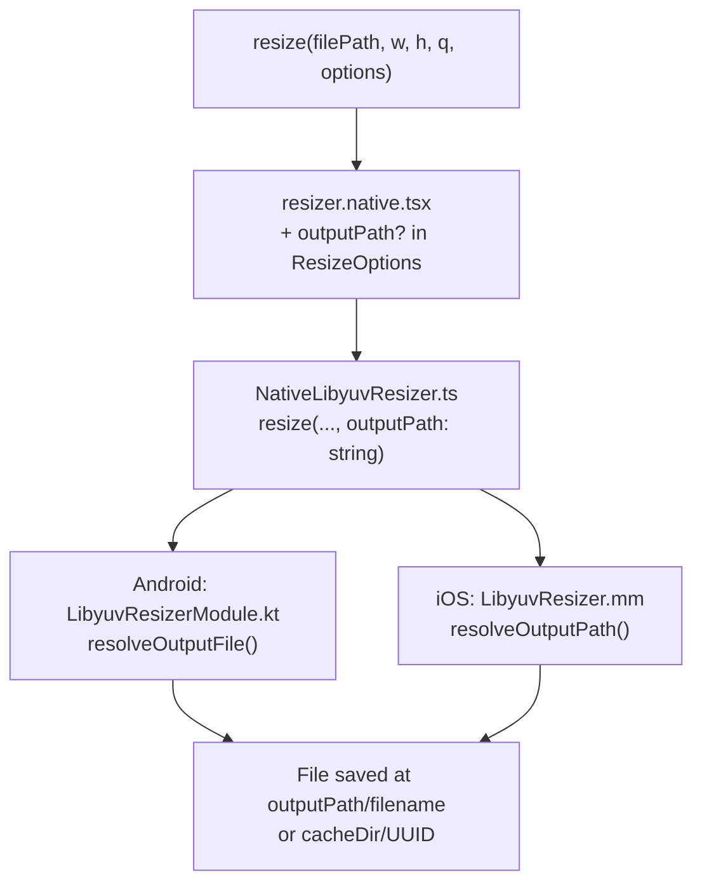

# Custom Output Path — Design

**Spec**: `.specs/features/custom-output-path/spec.md`
**Status**: Draft

---

## Architecture Overview

Minimal delta: `outputPath` threads through each layer as a string. JS passes `''` when omitted; native interprets `''` as "use default". No new abstractions.



---

## Code Reuse Analysis

### Existing Components to Leverage

| Component | Location | How to Use |
|-----------|----------|------------|
| `ResizeOptions` interface | `src/resizer.native.tsx:6` | Add `outputPath?: string` field |
| `resize()` JS wrapper | `src/resizer.native.tsx:17` | Extract `outputPath` and pass to native |
| `Spec.resize()` bridge | `src/NativeLibyuvResizer.ts:5` | Add 7th positional `outputPath: string` param |
| `LibyuvResizerModule.resize()` | `android/.../LibyuvResizerModule.kt:15` | Add `outputPath: String` param; add `resolveOutputFile()` helper |
| Existing error pattern | `LibyuvResizerModule.kt:26` | Same `promise.reject(code, msg)` pattern for new validations |

### Integration Points

| System | Integration Method |
|--------|--------------------|
| TurboModule bridge | 7th positional `String` param — native codegen must regenerate |
| Android file I/O | `File(filePath).name` to extract original filename; `File(outputPath).isDirectory` for validation |
| iOS file I/O | `[[filePath lastPathComponent]` to extract filename; `NSFileManager` for dir validation |

---

## Components

### `ResizeOptions` (TS)

- **Purpose**: Expose `outputPath` to callers
- **Location**: `src/resizer.native.tsx`
- **Interfaces**:
  - Add `outputPath?: string` to existing `ResizeOptions` interface
- **Reuses**: Existing interface, no new file

### `resize()` JS wrapper

- **Purpose**: Extract `outputPath`, pass `''` when absent
- **Location**: `src/resizer.native.tsx`
- **Interfaces**:
  - `resize(filePath, w, h, q, options?)` — unchanged public API shape
- **Reuses**: Existing `options?.rotation` / `options?.mode` extraction pattern

### `Spec` TurboModule (TS bridge)

- **Purpose**: Define native method signature for codegen
- **Location**: `src/NativeLibyuvResizer.ts`
- **Interfaces**:
  ```ts
  resize(
    filePath: string,
    targetWidth: number,
    targetHeight: number,
    quality: number,
    rotation: number,
    mode: string,
    outputPath: string   // ← new; '' = use default
  ): Promise<string>
  ```
- **Note**: TurboModule bridge doesn't support optional params — always pass a string

### `LibyuvResizerModule` (Android)

- **Purpose**: Resolve output file location, save resized bitmap there
- **Location**: `android/src/main/java/com/libyuvresizer/LibyuvResizerModule.kt`
- **New helper**:
  ```kotlin
  private fun resolveOutputFile(inputFilePath: String, outputPath: String, ext: String): File {
      if (outputPath.isEmpty()) {
          return File(reactApplicationContext.cacheDir, "${UUID.randomUUID()}.$ext")
      }
      val dir = File(outputPath)
      if (!dir.exists()) throw IllegalArgumentException("Output directory does not exist: $outputPath")
      if (!dir.isDirectory) throw IllegalArgumentException("outputPath must be a directory, not a file: $outputPath")
      return File(dir, File(inputFilePath).name)
  }
  ```
- **Replaces** inline `File(cacheDir, "${UUID.randomUUID()}.$ext")` at line 95
- **Reuses**: Existing error-rejection pattern

### `LibyuvResizer.mm` (iOS)

- **Purpose**: Same resolution logic on iOS
- **Location**: `ios/LibyuvResizer.mm`
- **Note**: iOS `resize` is not yet implemented. Add `outputPath` param to the method signature from the start — no migration cost.

---

## Data Models

No new data models. `outputPath` is a plain `String`/`string`.

---

## Error Handling Strategy

| Error Scenario | Error Code | Message |
|----------------|------------|---------|
| `outputPath` dir does not exist | `E_INVALID_OUTPUT_PATH` | `"Output directory does not exist: <path>"` |
| `outputPath` is a file, not a dir | `E_INVALID_OUTPUT_PATH` | `"outputPath must be a directory, not a file: <path>"` |
| Empty string | — | Treated as omitted; use default cache behavior |

All thrown `IllegalArgumentException` from `resolveOutputFile()` are caught by the existing outer `catch (e: Exception)` block, which routes to `promise.reject("E_UNKNOWN", ...)`. Prefer rejecting with `E_INVALID_OUTPUT_PATH` directly (validate before calling the helper, or catch specifically).

---

## Tech Decisions

| Decision | Choice | Rationale |
|----------|--------|-----------|
| Pass `''` for absent outputPath | Empty string sentinel | TurboModule bridge requires fixed-arity positional args; no nullable primitives |
| Keep original input filename | `File(filePath).name` | Spec requirement; predictable for caller |
| Extension follows quality, not input name | Same as existing logic | Consistency — if q=100 → PNG; container = original name, content = quality-driven |
| Validate in Kotlin before `resolveOutputFile` | Explicit `promise.reject` with `E_INVALID_OUTPUT_PATH` | Surfaced error code is more useful to callers than generic `E_UNKNOWN` |
