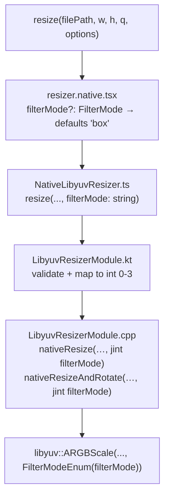

# FilterMode Parameter — Design

**Spec**: `.specs/features/filter-mode/spec.md`
**Status**: Draft

---

## Architecture Overview

Minimal 4-file delta. `filterMode` threads down from JS option → TurboModule string arg → Kotlin int → JNI `jint`. No new files, no new abstractions.



---

## Code Reuse Analysis

| Component | Location | Change |
|-----------|----------|--------|
| `ResizeOptions` interface | `src/resizer.native.tsx:6` | Add `filterMode?: FilterMode` |
| `VALID_MODES` pattern | `src/resizer.native.tsx:12` | Add `VALID_FILTER_MODES` const + validation |
| `Spec.resize()` bridge | `src/NativeLibyuvResizer.ts:5` | Add 8th positional `filterMode: string` param |
| `LibyuvResizerModule.resize()` | `android/.../LibyuvResizerModule.kt:15` | Add `filterMode: String` param + validation + mapping |
| `nativeResize` JNI | `android/src/main/cpp/LibyuvResizerModule.cpp:20` | Add `jint filterMode` param; replace `kFilterBox` literal |
| `nativeResizeAndRotate` JNI | `android/src/main/cpp/LibyuvResizerModule.cpp:57` | Add `jint filterMode` param; replace `kFilterBox` literal |

---

## Components

### `FilterMode` type + `ResizeOptions` (TS)

- **Location**: `src/resizer.native.tsx`
- **Changes**:
  ```ts
  export type FilterMode = 'none' | 'linear' | 'bilinear' | 'box';

  export interface ResizeOptions {
    rotation?: RotationAngle;
    mode?: ResizeMode;
    outputPath?: string;
    filterMode?: FilterMode; // new
  }
  ```
- **Validation**: same pattern as `mode` — check against `VALID_FILTER_MODES` array, reject with `TypeError` before calling native
- **Default**: `options?.filterMode ?? 'box'` — always passes an explicit string; no sentinel needed

### `Spec` TurboModule bridge

- **Location**: `src/NativeLibyuvResizer.ts`
- **Change**: 8th positional param `filterMode: string`
- **Note**: Always receives one of `'none'|'linear'|'bilinear'|'box'`; never empty (JS defaults to `'box'`)

### `LibyuvResizerModule` (Kotlin)

- **Location**: `android/.../LibyuvResizerModule.kt`
- **New param**: `filterMode: String` (8th)
- **Validation**: check `filterMode in setOf("none", "linear", "bilinear", "box")` — reject `E_INVALID_FILTER_MODE`
- **Mapping** (pure function, no state):
  ```kotlin
  private fun filterModeToInt(mode: String): Int = when (mode) {
      "none"     -> 0  // kFilterNone
      "linear"   -> 1  // kFilterLinear
      "bilinear" -> 2  // kFilterBilinear
      else       -> 3  // kFilterBox (validated, so only "box" reaches here)
  }
  ```
- **Passing to JNI**: `nativeResize(srcBitmap, dstBitmap, filterModeToInt(filterMode))`
- **Reuses**: existing `override fun resize(...)` method; same `promise.reject` error pattern

### `LibyuvResizerModule.cpp` (JNI/C++)

- **Location**: `android/src/main/cpp/LibyuvResizerModule.cpp`
- **Both JNI functions** add `jint filterMode` param and cast to `libyuv::FilterModeEnum`:
  ```cpp
  libyuv::ARGBScale(
      ...,
      static_cast<libyuv::FilterModeEnum>(filterMode)
  );
  ```
- `filterMode` is validated in Kotlin before JNI call — C++ trusts the int is 0–3

### iOS stub

- `ios/LibyuvResizer.mm` — add `filterMode` param to match updated codegen spec; silently ignore (no-op). Resize not yet implemented on iOS.

---

## Data Models

No new data models. `FilterMode` is a string union at TS level, `Int` at JNI boundary.

---

## Error Handling

| Scenario | Where caught | Error code | Message |
|----------|-------------|------------|---------|
| Unknown `filterMode` string | JS (`resizer.native.tsx`) | `TypeError` | `"Invalid filter mode: '<value>'"` |
| Unknown `filterMode` (defense) | Kotlin | `E_INVALID_FILTER_MODE` | `"filterMode must be none, linear, bilinear, or box, got: <value>"` |

---

## Tech Decisions

| Decision | Choice | Rationale |
|----------|--------|-----------|
| JS always resolves to explicit string | Default to `'box'` at JS layer | No sentinel needed; Kotlin just maps string → int |
| Validate in both JS and Kotlin | Two-layer check | JS = fast rejection with clear TS error; Kotlin = defense against raw native calls |
| Pass as `jint` to JNI | Int, not string | Avoids JNI string marshaling; `FilterModeEnum` is just an int in libyuv |
| `filterModeToInt` as private fun | Kotlin helper | Isolates mapping logic; `else -> 3` is safe because validation already ran |
