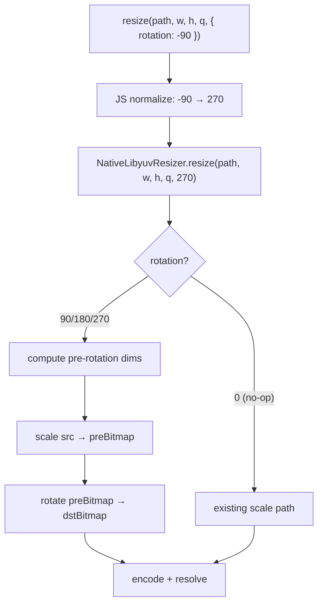

# Image Rotation Design

**Spec**: `.specs/features/image-rotation/spec.md`
**Status**: Draft

---

## Architecture Overview

Add `rotation` as optional 5th param through every layer. JS normalizes negative angles → canonical positive. Native receives `0 | 90 | 180 | 270` as int. When rotation != 0: **scale first** (to pre-rotation dims) **then rotate** — cheaper because we rotate fewer pixels after downscaling.



**Scale-first rationale**: for a 1920×1080→540×960 with 90° rotation:
- Scale-first: rotate 960×540 pixels (after downscale)
- Rotate-first: rotate 1,920×1,080 pixels, then scale — 3.5× more work

---

## Code Reuse Analysis

### Existing Components to Leverage

| Component | Location | How to Use |
|-----------|----------|------------|
| `NativeLibyuvResizer.ts` | `src/NativeLibyuvResizer.ts` | Extend `resize` signature — add `rotation: number` 5th param |
| `resize` in `multiply.native.tsx` | `src/multiply.native.tsx` | Extend options object, normalize angle, forward to native |
| `LibyuvResizerModule.kt` | `android/.../LibyuvResizerModule.kt` | Add pre-rotation dim swap, create intermediate bitmap, call new `nativeRotate` |
| `nativeResize` JNI | `android/src/main/cpp/LibyuvResizerModule.cpp` | Unchanged — still handles scale; add sibling `nativeRotate` |
| `libyuv` submodule | `libyuv/` | Already linked; add `#include "libyuv/rotate_argb.h"` (no CMake change needed) |
| `LibyuvResizer.mm` | `ios/LibyuvResizer.mm` | Implement `resize` with vImage scale + rotate (currently stub) |

### Integration Points

| System | Integration Method |
|--------|--------------------|
| Codegen (TurboModule spec) | `rotation: number` added to `Spec.resize` — codegen regenerates Kotlin/ObjC++ stubs at build |
| Android `Bitmap` lifecycle | Kotlin creates intermediate `preBitmap` for scale result; recycled after rotate |
| iOS `vImage_Buffer` | Stack-allocated; freed via `free(buffer.data)` after each step |

---

## Components

### JS Type + Normalization

- **Purpose**: Define `RotationAngle` type, expose options-bag API, normalize negative angles before native call
- **Location**: `src/multiply.native.tsx` (logic) + `src/index.tsx` (re-export type)
- **Interfaces**:
  ```typescript
  type RotationAngle = 0 | 90 | 180 | 270 | -90 | -180 | -270;

  interface ResizeOptions {
    rotation?: RotationAngle;
  }

  function resize(
    filePath: string,
    targetWidth: number,
    targetHeight: number,
    quality: number,
    options?: ResizeOptions
  ): Promise<string>
  ```
- **Normalization** (in `multiply.native.tsx`):
  ```typescript
  function toCanonicalAngle(angle: RotationAngle): 0 | 90 | 180 | 270 {
    return (((angle % 360) + 360) % 360) as 0 | 90 | 180 | 270;
  }
  ```
- **Dependencies**: `NativeLibyuvResizer` (native bridge)
- **Reuses**: existing `LibyuvResizer.resize` call — wraps it

### Turbo Module Spec

- **Purpose**: Source-of-truth for codegen; native platforms derive their typed stubs from this
- **Location**: `src/NativeLibyuvResizer.ts`
- **Change**: Add `rotation: number` as 5th param (always present; JS sends `0` when no rotation)
  ```typescript
  export interface Spec extends TurboModule {
    resize(
      filePath: string,
      targetWidth: number,
      targetHeight: number,
      quality: number,
      rotation: number
    ): Promise<string>;
  }
  ```
- **Note**: Turbo Module codegen does not support optional primitives — use `0` as the no-rotation sentinel

### Android Kotlin Layer (`LibyuvResizerModule.kt`)

- **Purpose**: Orchestrate decode → (optional pre-rotate scale) → scale → rotate → encode
- **Location**: `android/src/main/java/com/libyuvresizer/LibyuvResizerModule.kt`
- **New logic** (when `rotation != 0`):
  ```
  preW = if (rotation == 90 || rotation == 270) dstH else dstW
  preH = if (rotation == 90 || rotation == 270) dstW else dstH
  preBitmap = Bitmap(preW, preH, ARGB_8888)
  nativeResize(srcBitmap, preBitmap)          // existing JNI
  srcBitmap.recycle()
  dstBitmap = Bitmap(dstW, dstH, ARGB_8888)
  nativeRotate(preBitmap, dstBitmap, rotation) // new JNI
  preBitmap.recycle()
  ```
- **New JNI declaration**:
  ```kotlin
  private external fun nativeRotate(srcBitmap: Bitmap, dstBitmap: Bitmap, rotation: Int)
  ```
- **Validation**: reject if `rotation !in setOf(0, 90, 180, 270)` (JS normalizes; Kotlin is last guard)
- **Reuses**: `nativeResize`, existing decode/encode/file-write path

### Android C++ Layer (`LibyuvResizerModule.cpp`)

- **Purpose**: Call `libyuv::ARGBRotate` with raw Bitmap pixel pointers
- **Location**: `android/src/main/cpp/LibyuvResizerModule.cpp`
- **New function**:
  ```cpp
  #include "libyuv/rotate_argb.h"

  extern "C" JNIEXPORT void JNICALL
  Java_com_libyuvresizer_LibyuvResizerModule_nativeRotate(
      JNIEnv* env, jobject, jobject srcBitmap, jobject dstBitmap, jint rotation
  ) {
      AndroidBitmapInfo srcInfo{}, dstInfo{};
      AndroidBitmap_getInfo(env, srcBitmap, &srcInfo);
      AndroidBitmap_getInfo(env, dstBitmap, &dstInfo);

      void* srcPixels = nullptr;
      void* dstPixels = nullptr;
      AndroidBitmap_lockPixels(env, srcBitmap, &srcPixels);
      AndroidBitmap_lockPixels(env, dstBitmap, &dstPixels);

      libyuv::RotationMode mode = libyuv::kRotate0;
      if (rotation == 90)  mode = libyuv::kRotate90;
      if (rotation == 180) mode = libyuv::kRotate180;
      if (rotation == 270) mode = libyuv::kRotate270;

      libyuv::ARGBRotate(
          static_cast<const uint8_t*>(srcPixels), srcInfo.stride,
          static_cast<uint8_t*>(dstPixels),       dstInfo.stride,
          srcInfo.width, srcInfo.height,
          mode
      );

      AndroidBitmap_unlockPixels(env, srcBitmap);
      AndroidBitmap_unlockPixels(env, dstBitmap);
  }
  ```
- **CMake**: no change — `libyuv` target already linked; `rotate_argb.h` is in the same submodule
- **Reuses**: existing `lockPixels` / `unlockPixels` pattern from `nativeResize`

### iOS Objective-C++ Layer (`LibyuvResizer.mm`)

- **Purpose**: Implement `resize` (currently stub) with vImage scale + rotate
- **Location**: `ios/LibyuvResizer.mm`
- **Approach**: `vImageScale_ARGB8888` then `vImageRotate90_ARGB8888` (Accelerate framework)
- **Key vImage calls**:
  ```objc
  // scale step
  vImageScale_ARGB8888(&srcBuffer, &preBuffer, nil, kvImageNoFlags);

  // rotate step (rotation: 0=0°, 1=90°, 2=180°, 3=270°)
  uint8_t vImageRot = (uint8_t)(rotation / 90);
  uint8_t backColor[4] = {0, 0, 0, 255};
  vImageRotate90_ARGB8888(&preBuffer, &dstBuffer, vImageRot, backColor, kvImageNoFlags);
  ```
- **Buffer lifecycle**: `malloc` for intermediate + dst pixel data; `free` after `UIImage` wraps data
- **Encode**: `UIImageJPEGRepresentation` / `UIImagePNGRepresentation` → write to `NSTemporaryDirectory()`
- **Reuses**: existing `getTurboModule:` JSI wiring; adds `resize:` method implementation

---

## Data Models

### JS → Native Contract

```typescript
// What JS sends over JSI
{
  filePath: string,    // absolute file path
  targetWidth: number, // final output width (after rotation)
  targetHeight: number,// final output height (after rotation)
  quality: number,     // 1–100; 100 → PNG
  rotation: number     // canonical: 0 | 90 | 180 | 270
}
```

### Pre-rotation Dimensions (computed in native)

| rotation | preW | preH |
|----------|------|------|
| 0 | dstW | dstH |
| 90 | dstH | dstW |
| 180 | dstW | dstH |
| 270 | dstH | dstW |

---

## Error Handling Strategy

| Error Scenario | Handling | User Impact |
|----------------|----------|-------------|
| Invalid angle (JS) | Throw `Error("Invalid rotation angle: X. Must be 0/90/180/270/-90/-180/-270")` synchronously before native call | Caught in `.catch()` or `try/catch` |
| Invalid angle (Kotlin guard) | `promise.reject("E_INVALID_ROTATION", "rotation must be 0/90/180/270, got: $rotation")` | Same reject as other validation errors |
| Bitmap alloc fails (OOM) | Caught in existing `catch (e: Exception)` block → `E_UNKNOWN` | Promise rejected |
| vImage alloc fails (iOS) | Return `NSError` → promise rejected via JSI | Promise rejected |
| `lockPixels` fails | Existing `ThrowNew(RuntimeException)` pattern | Promise rejected |

---

## Tech Decisions

| Decision | Choice | Rationale |
|----------|--------|-----------|
| Scale-first vs rotate-first | Scale first | Fewer pixels to rotate after downscale → faster |
| Intermediate buffer location | Android: `Bitmap` object (same pattern as dst); iOS: `malloc`'d `vImage_Buffer` | Consistent with existing patterns per platform |
| Angle normalization location | JS (`multiply.native.tsx`) | Single normalization point; native stays simple; TS type enforces at compile time |
| `rotation=0` fast path | Skip pre-rotate Bitmap alloc entirely | No overhead for non-rotating callers |
| libyuv header | `rotate_argb.h` (not `rotate.h`) | `ARGBRotate` is in the ARGB-specific header; matches existing `scale_argb.h` pattern |
| Codegen param type | `number` (not `double`) | Codegen maps `number` → `Int` in Kotlin via generated spec; rotation is always integer |
