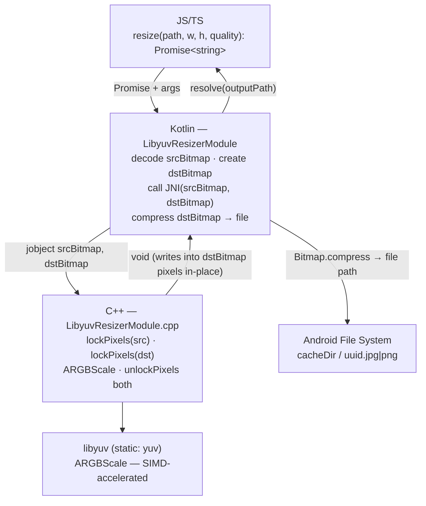

# libyuv Android Integration — Design

**Spec**: `.specs/features/libyuv-android-integration/spec.md`
**Status**: Approved

---

## Architecture Overview

Four layers; each owns one responsibility. C++ operates directly on Bitmap native memory via `AndroidBitmap_lockPixels` — **zero large byte copies over JNI**.



---

## Code Reuse Analysis

### Existing Components to Leverage

| Component | Location | How to Use |
|-----------|----------|------------|
| `LibyuvResizerModule.kt` | `android/src/main/java/com/libyuvresizer/` | Replace `multiply` with `resize`; declare `nativeResize(Bitmap, Bitmap)` external |
| `CMakeLists.txt` | `android/CMakeLists.txt` | Already has `add_subdirectory(../libyuv)` + `yuv`; add `jnigraphics` (now required) |
| `build.gradle` | `android/build.gradle` | No changes needed — externalNativeBuild + all 4 ABIs already configured |
| `NativeLibyuvResizer.ts` | `src/NativeLibyuvResizer.ts` | Replace `multiply` spec with `resize` |
| libyuv submodule | `libyuv/` | `ARGBScale` from `libyuv/include/libyuv/scale_argb.h`; static target `yuv` |

### Integration Points

| System | Integration Method |
|--------|-------------------|
| Android `BitmapFactory` | Decode source file to `Bitmap.ARGB_8888` in Kotlin |
| `jnigraphics` (`android/bitmap.h`) | **Required** — `AndroidBitmap_lockPixels` / `unlockPixels` / `getInfo` give C++ a direct pointer to Bitmap pixel memory |
| Android `Bitmap.compress()` | Encode dstBitmap to JPEG/PNG in Kotlin after JNI returns |
| React Native Promise API | `NativeLibyuvResizerSpec` already wired; use `promise.resolve` / `promise.reject` |

---

## Components

### 1. TypeScript Spec — `NativeLibyuvResizer.ts`

- **Purpose**: Turbo Module contract; defines the JS-visible API
- **Location**: `src/NativeLibyuvResizer.ts`
- **Interface**:
  ```typescript
  resize(
    filePath: string,
    targetWidth: number,
    targetHeight: number,
    quality: number  // 1–100; 100 = lossless PNG, else JPEG
  ): Promise<string>;  // resolves with output file path
  ```
- **Remove**: `multiply(a: number, b: number): number`
- **Dependencies**: none beyond TurboModuleRegistry

---

### 2. Kotlin Module — `LibyuvResizerModule.kt`

- **Purpose**: Bridge between JS Promise and JNI; owns all Android-side image I/O
- **Location**: `android/src/main/java/com/libyuvresizer/LibyuvResizerModule.kt`
- **Interfaces**:
  ```kotlin
  // Called from JS via Turbo Module
  override fun resize(
      filePath: String,
      targetWidth: Double,
      targetHeight: Double,
      quality: Double,
      promise: Promise
  )

  // JNI declaration — C++ writes into dstBitmap pixels directly
  private external fun nativeResize(
      srcBitmap: Bitmap,
      dstBitmap: Bitmap
  )
  ```
- **resize() flow**:
  1. Validate inputs (file exists, dims > 0, quality 1–100) → `promise.reject` on failure
  2. `BitmapFactory.decodeFile(filePath)` with `inPreferredConfig = ARGB_8888` → null check
  3. `Bitmap.createBitmap(targetWidth, targetHeight, ARGB_8888)` → dstBitmap
  4. `nativeResize(srcBitmap, dstBitmap)` — C++ scales pixels in-place into dstBitmap
  5. `srcBitmap.recycle()`
  6. `FileOutputStream(cacheDir / "${UUID.randomUUID()}.jpg|png")` → `dstBitmap.compress(JPEG|PNG, quality)`
  7. `dstBitmap.recycle()`
  8. `promise.resolve(outputFile.absolutePath)`
- **Dependencies**: `NativeLibyuvResizerSpec`, `android.graphics.*`, `java.io.*`
- **Companion object**: `System.loadLibrary("libyuvresizer")`

---

### 3. C++ JNI Layer — `LibyuvResizerModule.cpp`

- **Purpose**: Lock Bitmap pixel memory, call `libyuv::ARGBScale`, unlock — no allocation, no copies
- **Location**: `android/src/main/cpp/LibyuvResizerModule.cpp`
- **JNI signature**:
  ```cpp
  extern "C" JNIEXPORT void JNICALL
  Java_com_libyuvresizer_LibyuvResizerModule_nativeResize(
      JNIEnv* env,
      jobject /* thiz */,
      jobject srcBitmap,
      jobject dstBitmap
  )
  ```
- **Implementation**:
  ```cpp
  AndroidBitmapInfo srcInfo{}, dstInfo{};
  AndroidBitmap_getInfo(env, srcBitmap, &srcInfo);
  AndroidBitmap_getInfo(env, dstBitmap, &dstInfo);

  void* srcPixels = nullptr;
  void* dstPixels = nullptr;

  if (AndroidBitmap_lockPixels(env, srcBitmap, &srcPixels) < 0 ||
      AndroidBitmap_lockPixels(env, dstBitmap, &dstPixels) < 0) {
      // throw back to Kotlin as Java exception
      jclass ex = env->FindClass("java/lang/RuntimeException");
      env->ThrowNew(ex, "AndroidBitmap_lockPixels failed");
      return;
  }

  libyuv::ARGBScale(
      static_cast<const uint8_t*>(srcPixels), srcInfo.stride,
      srcInfo.width,  srcInfo.height,
      static_cast<uint8_t*>(dstPixels),       dstInfo.stride,
      dstInfo.width,  dstInfo.height,
      libyuv::kFilterBox
  );

  AndroidBitmap_unlockPixels(env, srcBitmap);
  AndroidBitmap_unlockPixels(env, dstBitmap);
  ```
- **Note on pixel format**: Android `Bitmap.ARGB_8888` is stored as RGBA in memory. libyuv `ARGBScale` treats pixels as 4 bytes opaquely when scaling — channel order is irrelevant for scale-only operations. No conversion needed.
- **Dependencies**: `<android/bitmap.h>`, `libyuv/scale_argb.h`, JNI headers
- **No heap allocation, no file I/O**

---

### 4. CMake — `CMakeLists.txt`

- **Purpose**: Build config for the shared native library
- **Location**: `android/CMakeLists.txt`
- **Changes**: add `jnigraphics` (now required for `android/bitmap.h`)

```cmake
target_link_libraries(
    ${PACKAGE_NAME}
    ${LOG_LIB}
    android
    jnigraphics
    yuv
)
```

Everything else (source file, `add_subdirectory`, include dirs) already correct.

---

## Data Models

### Output format selection

| quality | Format | Compression |
|---------|--------|-------------|
| 1–99    | JPEG   | `quality.toInt()` |
| 100     | PNG    | lossless |

---

## Error Handling Strategy

| Error Scenario | Layer | Handling | Promise result |
|----------------|-------|----------|----------------|
| File not found | Kotlin | `File(path).exists()` check | `reject("E_FILE_NOT_FOUND", "File not found: $filePath")` |
| Invalid dims (≤ 0) | Kotlin | explicit check | `reject("E_INVALID_DIMS", "Invalid dimensions")` |
| Quality out of range | Kotlin | explicit check | `reject("E_INVALID_QUALITY", "Quality must be between 1 and 100")` |
| BitmapFactory returns null | Kotlin | null check after decode | `reject("E_DECODE_FAILED", "Failed to decode image")` |
| `lockPixels` fails | C++ | `ThrowNew(RuntimeException)` | Kotlin `try/catch` wraps JNI call → `reject("E_SCALE_FAILED", e.message)` |
| Any uncaught exception | Kotlin | `try/catch(Exception)` around entire `resize()` | `reject("E_UNKNOWN", e.message)` |

---

## Tech Decisions

| Decision | Choice | Rationale |
|----------|--------|-----------|
| `AndroidBitmap_lockPixels` not `ByteArray` marshaling | `lockPixels` | Zero large copies over JNI; C++ gets raw pointer to Bitmap's native memory; eliminates `copyPixelsToBuffer` + `copyPixelsFromBuffer` round-trip |
| Both Bitmaps created in Kotlin | Kotlin allocates, C++ writes | Avoids JNI reflection to call `Bitmap.createBitmap`; Kotlin side stays readable |
| `ARGBScale` not `I420Scale` | `ARGBScale` | Android `Bitmap.ARGB_8888` is 4 bytes/pixel; no color-space conversion needed |
| `kFilterBox` | `kFilterBox` | Primary use case is downscale; box filter averages pixel neighborhoods — highest quality for shrinking |
| File encode/decode stays in Kotlin | `BitmapFactory` + `Bitmap.compress` | Android codecs are hardware-accelerated; keeps C++ stateless |
| Output to `cacheDir` | `context.cacheDir` | OS-managed cleanup; caller copies to permanent storage if needed |
| Remove `multiply` entirely | Delete | Placeholder with no purpose; confuses public API |
