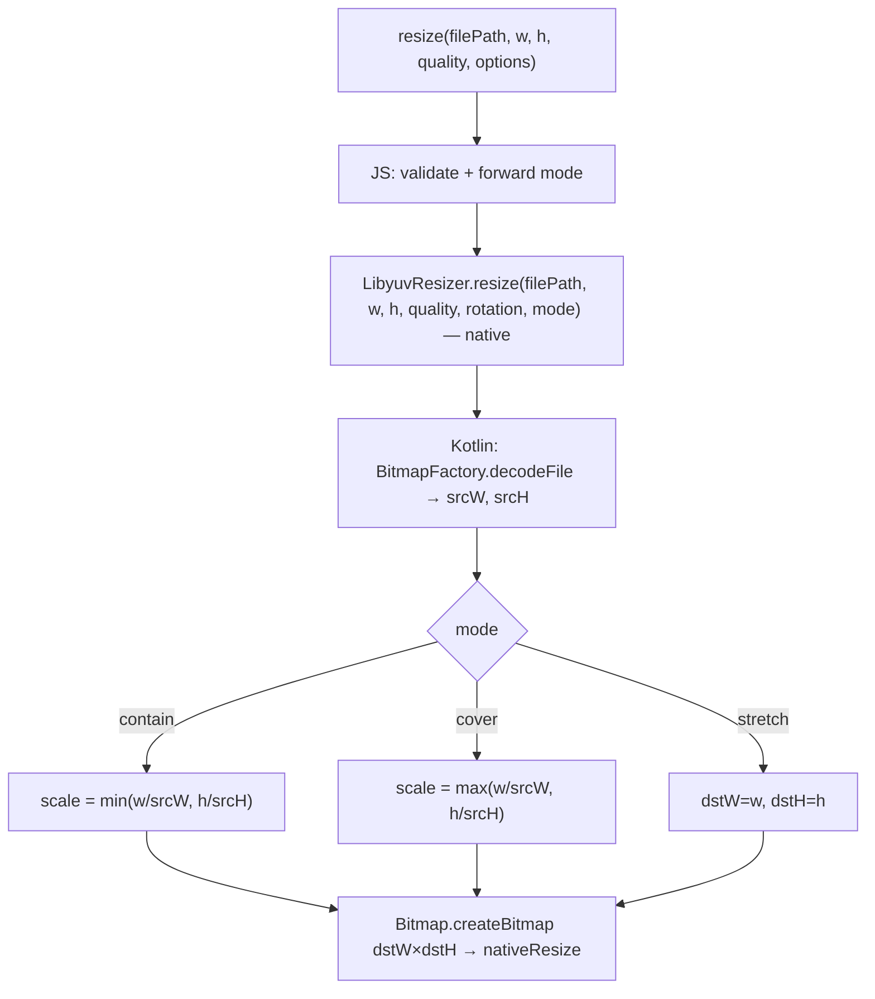

# Resize Mode Design

**Spec**: `.specs/features/resize-mode/spec.md`
**Status**: Draft

---

## Architecture Overview

Mode string forwarded to native. Native decodes bitmap (has `srcW`/`srcH` for free), computes actual scale dims, allocates `dstBitmap` with correct size, scales.



---

## Code Reuse Analysis

### Existing Components to Leverage

| Component | Location | How to Use |
|-----------|----------|------------|
| `resize()` wrapper | `src/multiply.native.tsx` → `src/resizer.native.tsx` | Add `mode` to `ResizeOptions`; validate and forward to native |
| `toCanonicalAngle` | `src/resizer.native.tsx` | Same pure-JS validation pattern for `mode` |
| `ResizeOptions` type | `src/resizer.native.tsx` | Add `mode?: ResizeMode` field |
| `LibyuvResizerModule.kt` | `android/.../LibyuvResizerModule.kt` | Bitmap already decoded here — `srcBitmap.width/height` available; add scale math before `Bitmap.createBitmap` |
| Web fallback | `src/multiply.tsx` → `src/resizer.tsx` | Mirror `mode` param; still throws "native only" |

### Integration Points

| System | Integration Method |
|--------|--------------------|
| Native bridge (`NativeLibyuvResizer.ts`) | Add `mode: string` as 6th param |
| `LibyuvResizerModule.kt` | Read `mode`, compute `dstW`/`dstH` after decode, before `Bitmap.createBitmap` |
| Public exports (`src/index.tsx`) | `ResizeMode` type added to exports; imports updated to `'./resizer'` |

---

## Components

### Scale math in `LibyuvResizerModule.kt`

- **Purpose**: Compute actual `dstW`/`dstH` from `srcW`, `srcH`, `targetW`, `targetH`, `mode` after bitmap decode
- **Location**: `android/src/main/java/com/libyuvresizer/LibyuvResizerModule.kt` (inline, not extracted)
- **Logic**:
  ```
  contain: scale = min(targetW / srcW, targetH / srcH)
  cover:   scale = max(targetW / srcW, targetH / srcH)
  stretch: dstW = targetW, dstH = targetH
  dstW = max(1, round(srcW * scale))
  dstH = max(1, round(srcH * scale))
  ```
- **Dependencies**: `srcBitmap.width`, `srcBitmap.height` — already in scope after `BitmapFactory.decodeFile`
- **Reuses**: existing validation block pattern in `LibyuvResizerModule.kt`

### Updated `ResizeOptions`

- **Purpose**: Extend existing options bag with `mode`
- **Location**: `src/resizer.native.tsx` (renamed from `multiply.native.tsx`)
- **Interfaces**:
  ```typescript
  export type ResizeMode = 'contain' | 'cover' | 'stretch';

  export interface ResizeOptions {
    rotation?: RotationAngle;
    mode?: ResizeMode;  // default: 'contain'
  }
  ```
- **Reuses**: existing `ResizeOptions` interface

---

## Error Handling Strategy

| Error Scenario | Handling | User Impact |
|----------------|----------|-------------|
| Invalid `mode` string | JS throws `TypeError("Invalid resize mode: '${mode}'")` before native call | Clear message at call site |
| Unknown `mode` reaches Kotlin | `promise.reject("E_INVALID_MODE", "mode must be contain, cover, or stretch")` | Defense-in-depth; JS validation should catch first |
| Computed dimension rounds to 0 | Kotlin clamps to `max(1, value)` | Silent correction; 0-dim crashes native |

---

## Tech Decisions

| Decision | Choice | Rationale |
|----------|--------|-----------|
| Where mode math lives | Kotlin (native) | `srcW`/`srcH` already available post-decode; no extra file I/O or JNI call |
| Default mode | `contain` | Safer; callers wanting old stretch behavior pass `mode: 'stretch'` |
| Upscaling in contain | Allowed | Library should not second-guess caller's size policy |
| Export `ResizeMode` type | Yes, from `src/index.tsx` | Callers need it for TypeScript safety at call sites |
| iOS | Not implemented in this feature | `LibyuvResizer.mm` still has scaffold stub; iOS resize is out of scope |
